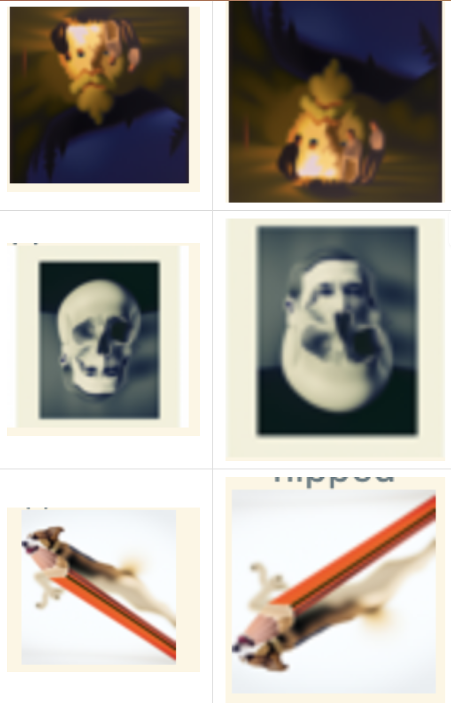
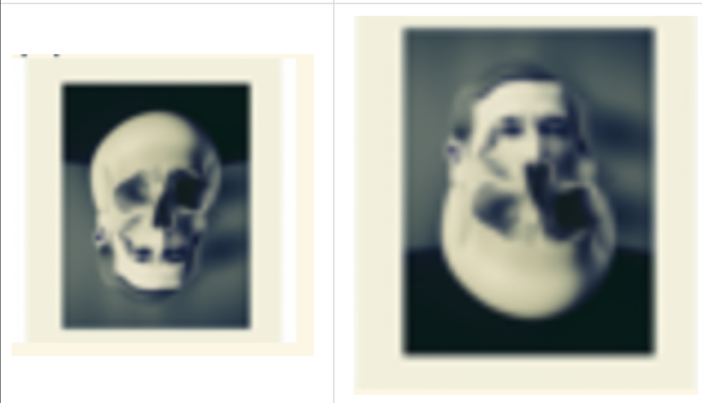
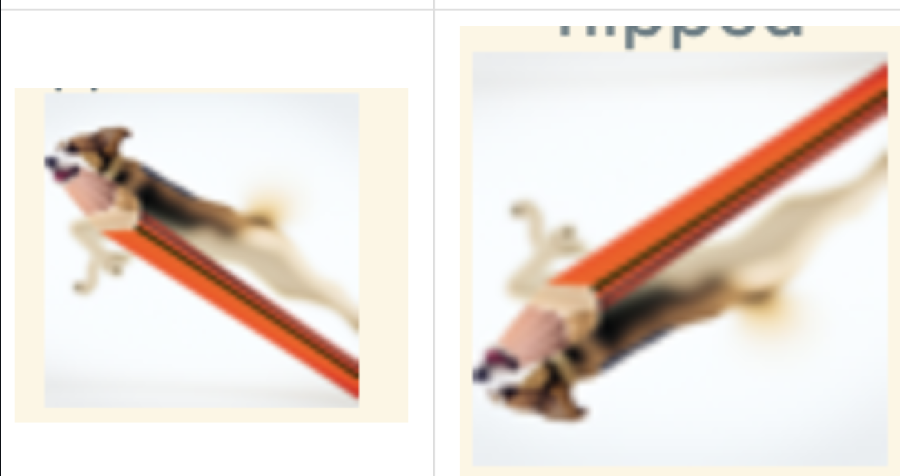
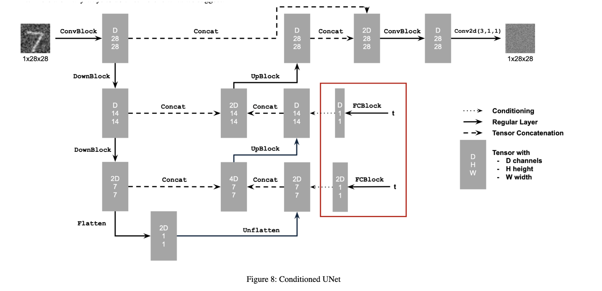
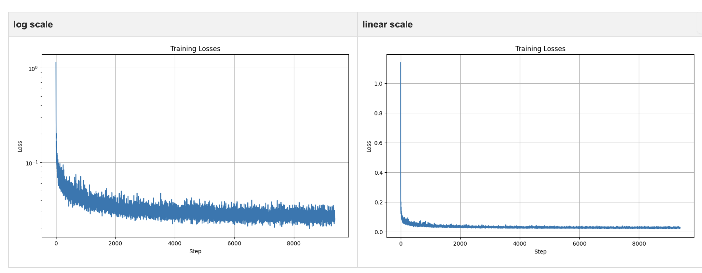
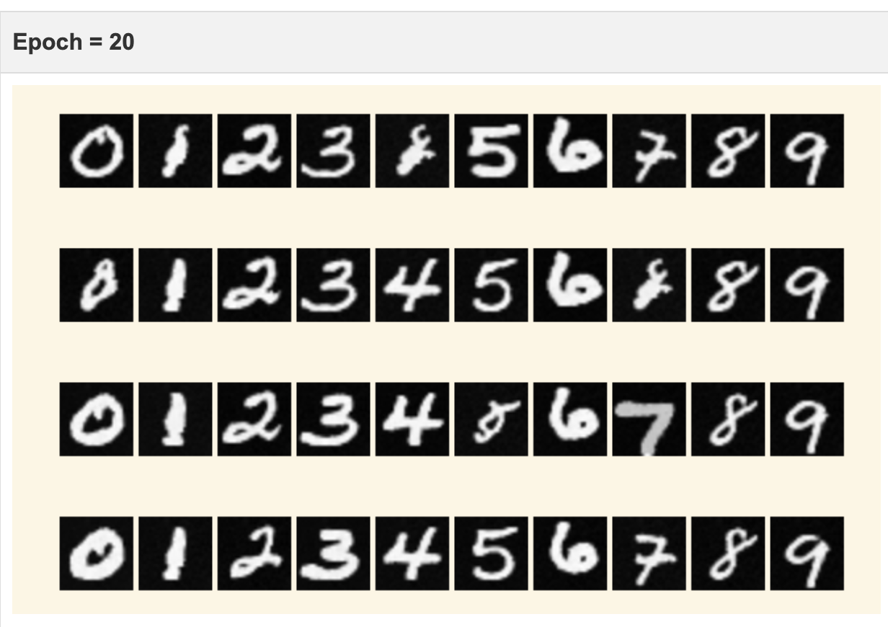

This repository contains `Python and Pytorch` code of Brayton Lordianto's work in Computer Vision CS 180/280 at UC Berkeley, 2025. It consists of: 
- using a pretrained DeepFloyd diffusion model to generate images and visual anagrams or hybrids. This entails implementing iterative denoising methods and Classifier-Free Guidance (CFG) to generate images from text prompts.
- training a diffusion model on MNIST data using DDPM (Denoising Diffusion Probabilistic Models) method. The underlying model is a U-Net architecture, and the models trained include an unconditional model, a time-conditioned model, and a class-conditioned model. The training process involves using a custom dataset and data loader, as well as implementing the diffusion process and loss functions.
- generalizing the diffusion model above using Flow Matching, which states that any linear interpolation of the noise can be used to generate a new image, in which a DDPM is simply a special case of a flow matching model. 

Preview of Projects:
<!--  -->
| Visual Anagram 1 : Skull or Waterfall? | Visual Anagram 2 : Dog or Pencil? | 
|:----------------:|:----------------:|
|  |  |

UNet Architecture:

Loss Curves:

Denoised Images:

